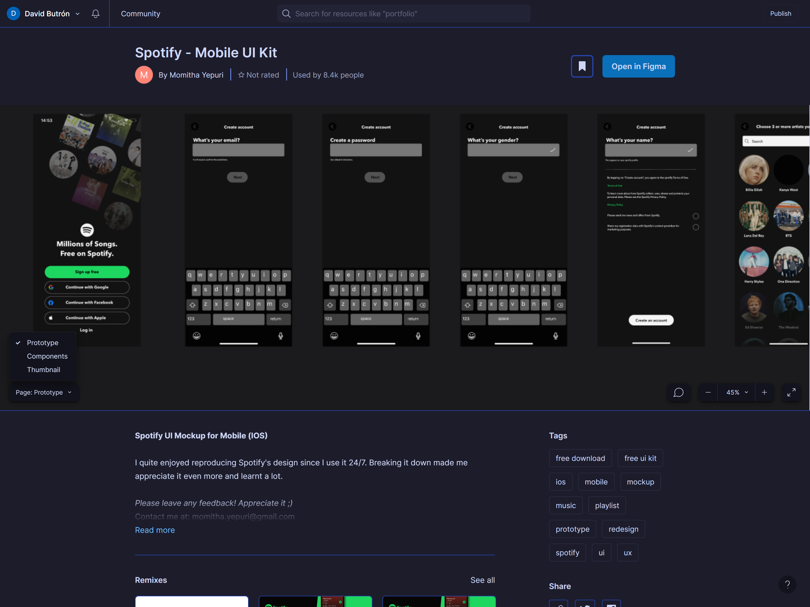
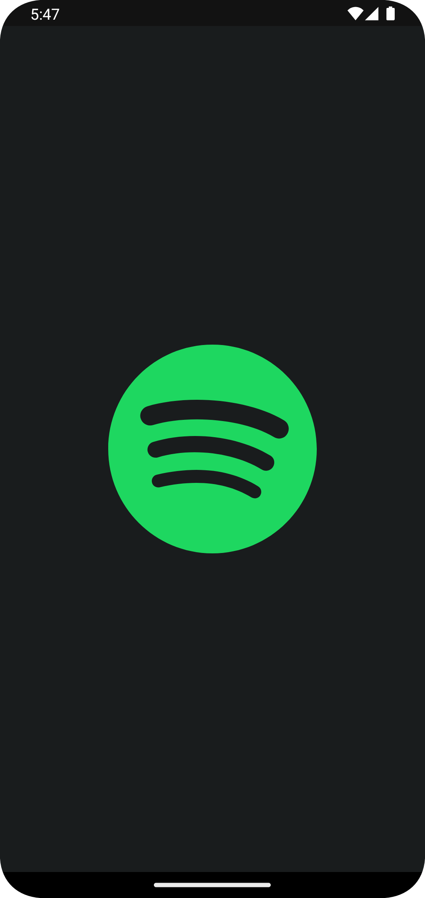
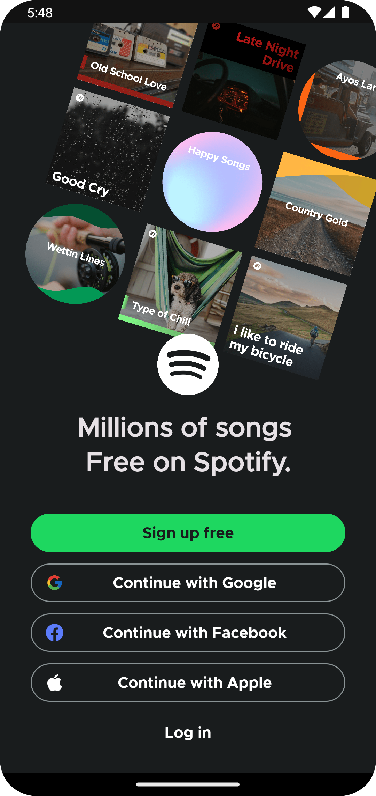
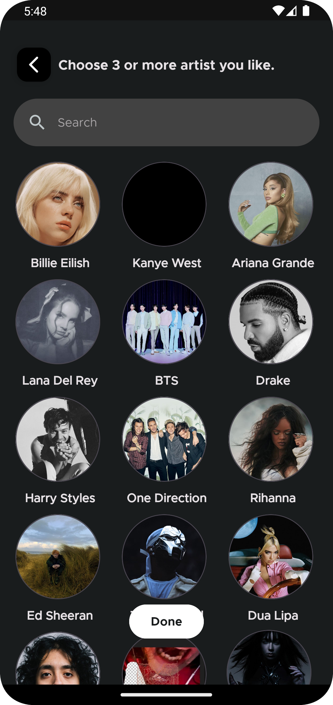
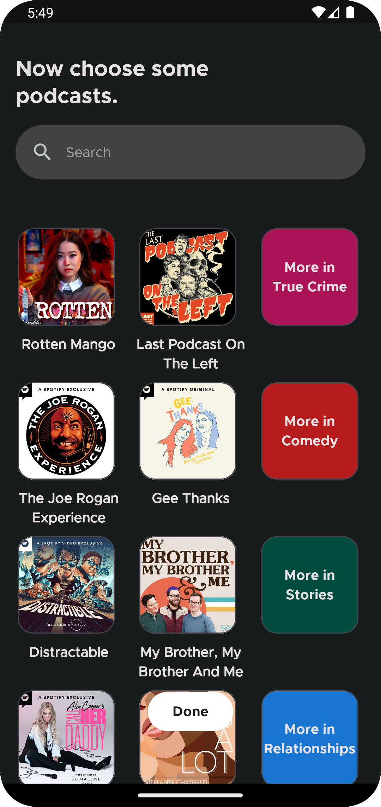
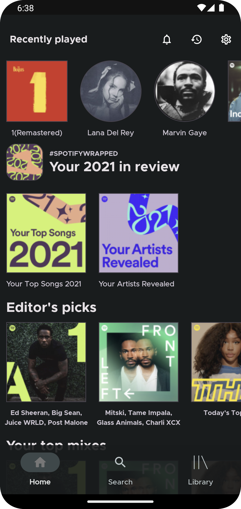
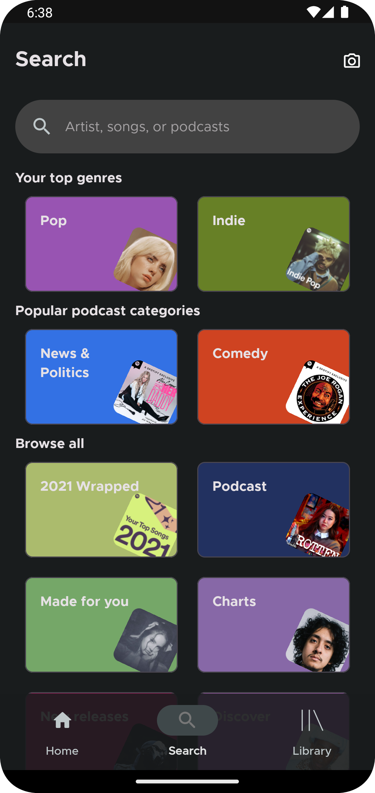
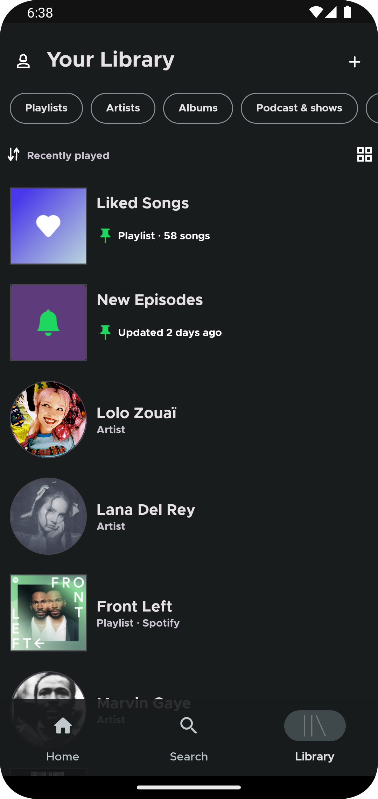

# Spotify UI Clone

Spotify UI Clone es una aplicación móvil que busca replicar la interfaz de usuario de Spotify. Esta aplicación se centra principalmente en la creación de una experiencia de usuario similar a la de Spotify en dispositivos móviles. Es importante destacar que se trata principalmente de una interfaz de usuario (UI) para practicar el desarrollo de UI/UX utilizando Kotlin y Android.

## Funcionalidades y Características ✨

- Replicación visual de la interfaz de usuario de Spotify.
- Diseño moderno y atractivo inspirado en Spotify.
- Explora la estructura y el diseño de la aplicación original de Spotify.

## Tecnologías Utilizadas 🛠️

- Kotlin: El lenguaje de programación principal utilizado para la creación de la interfaz de usuario.
- Android Studio: El entorno de desarrollo integrado (IDE) utilizado para construir la aplicación de Android.
- XML: Lenguaje de marcado utilizado para definir la interfaz de usuario de la aplicación.
- Material Design: Principios y directrices de diseño utilizados para crear una interfaz de usuario moderna y coherente.

## Aprendizaje y Destrezas Adquiridas 🦾

Durante el desarrollo de este proyecto, se han adquirido conocimientos y habilidades en:

- Creación y personalización de actividades de Android.
- Implementación de diseños de UI/UX inspirados en aplicaciones populares.
- Práctica en la creación de vistas y componentes de interfaz de usuario.
- Exploración de patrones de diseño y estilos utilizados en aplicaciones móviles populares.

## Inspiración UI 🎨

- UI Inspiration: [Spotify Mobile UI Kit](https://www.figma.com/community/file/1052832340031141040/Spotify---Mobile-UI-Kit)


## Capturas de Pantalla 🖼️

      

## Instalación y Uso 📥

1. Clona o descarga el repositorio en tu máquina local:

   ```shell
   git clone https://github.com/DaveDeveloper117/Spotify_UI_Clone.git` 

2.  Abre el proyecto en Android Studio.
    
3.  Ejecuta la aplicación en un emulador de Android o dispositivo físico.

## Contribución 🤝

Las contribuciones son bienvenidas. Si deseas mejorar el proyecto o agregar funcionalidades adicionales, puedes hacer un fork del repositorio, realizar tus cambios y enviar una pull request.

## Licencia 🗝️

Este proyecto está licenciado bajo [MIT License](https://github.com/DaveDeveloper117/Spotify_UI_Clone/blob/master/LICENSE).

## Contacto 📩

Si tienes alguna pregunta o sugerencia, no dudes en ponerte en contacto conmigo a través de mi dirección de correo electrónico: [dabicho803@gmail.com](mailto:dabicho803@gmail.com).
